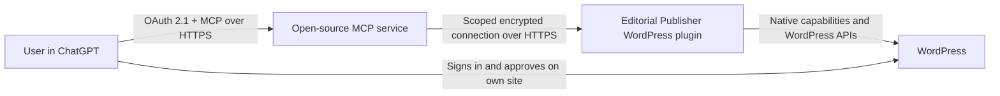

# Editorial Publisher for ChatGPT

Editorial Publisher for ChatGPT is an open-source ChatGPT app for secure WordPress editorial work. It can search and retrieve content, create and revise drafts, manage images, taxonomy, and SEO metadata, preview changes, and explicitly confirm scheduling or publishing.

> No OpenAI API key is required. The project does not call an LLM or the OpenAI API, so it creates no separate pay-per-token OpenAI API bill. Normal ChatGPT plan limits still apply.

## Capabilities

- Site-side connection approval without sharing a primary WordPress password
- Compact search, field-selected retrieval, clean Markdown, pagination, and revisions
- Patch-oriented draft writes with idempotency and optimistic concurrency
- Verified image upload, metadata, media search, and featured images
- Categories, tags, REST-enabled custom taxonomies, and normalized SEO adapters
- Structured review, error, metadata, result, and confirmation cards in ChatGPT
- Scheduling/publishing only after a short-lived, action-bound, single-use confirmation
- WordPress-side revocation, diagnostics, connection management, and tamper-evident audit metadata

## Architecture



The service verifies OAuth signature, audience, resource, client, connection, and scope. The plugin independently checks the connection scope, switches to the approving WordPress user, rechecks that user's current native capability, and applies route-specific safety policy. Rich cards are optional; every tool also returns useful structured/text output.

## Quick start

Requirements: Node.js 24 LTS, npm 11, Docker with Compose, and HTTPS for ChatGPT testing.

```sh
cp .env.example .env
# Fill WPCP_ENCRYPTION_KEY and WPCP_TOKEN_SIGNING_KEY with independent
# base64-encoded 32-byte values. Use local URLs only in development.
npm ci
docker compose up -d --build
```

The default local ports are WordPress `8080` and MCP `8787`; `MCP_HOST_PORT` can move the host-side MCP port. Use the complete seeded harness in [docs/test-harness.md](docs/test-harness.md) for real OAuth/E2E testing.

## Install the WordPress plugin

Build the uploadable release ZIP:

```sh
npm run package:wordpress
```

Upload `artifacts/editorial-publisher-for-chatgpt-1.0.2.zip` through **Plugins > Add Plugin > Upload Plugin**, activate it, then open **Editorial Publisher > Diagnostics**. Production connections require HTTPS. Use an Editor for normal editorial work and grant Publisher only where scheduling/publishing is intended.

## Deploy the MCP service

The service requires PostgreSQL and two independent 32-byte secrets. Supported paths:

- Published multi-platform image: `ghcr.io/asimons81/wp-chatgpt-publisher:1.0.2`
- A locally built OCI image from the included `Dockerfile`
- Docker Compose for the complete local topology
- Standard Node host: `npm ci && npm run build && node apps/mcp-server/dist/index.js`
- Vercel Node Function through `api/index.ts` and `vercel.json`

See [self-hosting](docs/self-hosting.md) for environment variables, PostgreSQL, Vercel, backups, rotation, scaling, upgrades, and rollback. No proprietary relay is mandatory.

### Update a source checkout

From a clean Git checkout on a branch with a configured upstream, check for an update without changing files:

```sh
npm run update -- --check
```

Run `npm run update` to review and confirm the exact fast-forward, or use `npm run update -- --yes` in non-interactive automation. The updater refuses dirty, detached, locally ahead, and diverged checkouts. After the fast-forward it installs the exact lockfile dependencies without lifecycle scripts and rebuilds the project. It does not deploy or restart the service, migrate infrastructure, modify secrets or databases, or replace the separately installed WordPress plugin; follow the deployment-specific upgrade and rollback steps in [self-hosting](docs/self-hosting.md).

## Connect from ChatGPT

Deploy the service on public HTTPS, then follow [ChatGPT setup](docs/chatgpt-setup.md). The OAuth flow redirects to the user's own WordPress login and approval screen; the normal WordPress password never passes through the MCP service or ChatGPT.

| Profile                 | Authority                                                                               |
| ----------------------- | --------------------------------------------------------------------------------------- |
| Read Only               | Site, content, drafts, media, taxonomy, and SEO reads                                   |
| Editorial (recommended) | Read Only plus draft, media, taxonomy assignment, and SEO writes                        |
| Publisher               | Editorial plus published edits, scheduling, and publishing; confirmation still required |

No v1 tool manages users, plugins, themes, settings, raw databases, raw filesystems, code, or permanent deletion.

## Security and privacy

- OAuth authorization code flow with S256 PKCE, resource indicators, short-lived JWT access tokens, and rotating opaque refresh tokens
- AES-256-GCM service-side credential encryption with connection-bound associated data; Sodium XChaCha20-Poly1305 for WordPress approval envelopes
- Connection and scope intersection at both layers, plus live WordPress capability checks
- DNS resolution/pinning, private/reserved-address rejection, restricted ports, no redirects, timeouts, and response caps
- Image MIME/decoder/size verification and safe WordPress sideloading
- Static tool definitions; retrieved WordPress content is untrusted data, never instructions
- Audit metadata only: no article bodies, prompts, conversations, binaries, primary passwords, or authorization headers
- Telemetry off by default and fail-closed production configuration

Read [SECURITY.md](SECURITY.md), the [threat model](docs/threat-model.md), and the [privacy template](docs/privacy-policy-template.md).

## Development and verification

```sh
npm run format:check
npm run lint
npm run typecheck
npm test
npm run test:integration
npm run test:e2e
npm run test:security
npm run build
npm run package:wordpress
npm run sbom
npm run release:reproducible
npm run release:artifacts
npm run release:check
```

Composer is optional on Windows; the `php:*` scripts use the official Composer container. CI runs Node/PHP quality gates, PHP 8.1-8.4, minimum/latest WordPress live stacks, CodeQL, dependency review, secret scanning, packaging, and draft release generation.

## Compatibility and limitations

WordPress 6.9+, PHP 8.1-8.4, Node 24, PostgreSQL 15-17, and a standard single-site REST setup are supported. See the [verified matrix](docs/compatibility.md).

Multisite, WordPress.com hosted plans, headless sites, disabled REST APIs, production HTTP, AIOSEO writes, permanent deletion, broad administration, autonomous publishing, and built-in LLM calls are excluded from v1.

## Release status

All local implementation, packaging, security, full-stack, lifecycle, and browser gates pass. The public Vercel service reports version `1.0.2` on durable PostgreSQL, and the signed `1.0.2` container image is publicly available for AMD64 and ARM64. The public WordPress and source ZIPs match local deterministic builds byte for byte. ChatGPT desktop developer-mode OAuth/read/draft/publish-review acceptance passes. Current OpenAI guidance says MCP apps are web-only, so mobile-client acceptance is not applicable. The expanded desktop pass and directory submissions are account-gated by OpenAI developer identity verification and the owner's final legal/contact details; see [project status](docs/status.md) and the [release checklist](docs/release-checklist.md).

## License

GPL-2.0-or-later for the complete repository. See [licensing](docs/licensing.md) and [third-party notices](THIRD_PARTY_NOTICES.md).
