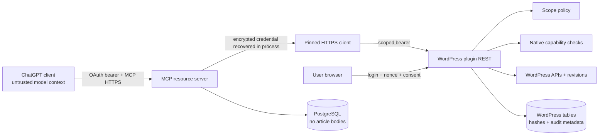

# Architecture

## System and trust boundaries

The browser, ChatGPT model-visible content, MCP service, WordPress plugin, WordPress user session, databases, and remote media origins are separate trust zones.

## Authentication

ChatGPT discovers RFC 9728 protected-resource metadata and OAuth authorization-server metadata. The service supports authorization code + S256 PKCE, DCR, resource indicators, short-lived JWT access tokens, and rotating opaque refresh tokens. The user supplies a site URL; the service validates and pins it, discovers the plugin, and redirects to the site's own authenticated admin approval screen. WordPress issues a one-time grant and an individually revocable bearer credential. The credential is irreversibly hashed in WordPress and transferred from an encrypted five-minute transient; the service stores it with AES-256-GCM and connection-bound associated data.

## Authorization

Each MCP tool has a static required scope and OAuth security scheme. The service verifies token signature, issuer, audience, expiry, client, connection, and scope. Each WordPress route repeats the scope check, sets the approving WordPress user, checks current native capabilities, and applies endpoint policy. Published edits, scheduling, and publishing additionally consume an action/content/version/payload-bound confirmation.

## Tool flow and data minimization

Read tools return excerpts, selected fields, stable pagination, and clean Markdown. Write tools use idempotency keys and return changed fields, status, version/revision, warnings, audit ID, and safe URLs. Article bodies pass through memory only and are not persisted by the MCP service. Operational logs exclude bodies and redact credential-shaped fields.

## Content fidelity

Metadata-only updates never send or rewrite `post_content`. Markdown creation uses conservative Gutenberg block conversion. Existing block content remains unchanged unless content is explicitly supplied. Unknown blocks are preserved because patch-oriented updates leave the original body untouched. Retrieval uses `parse_blocks` and conservative Markdown projection; raw storage is available only when explicitly requested and authorized.

## Deployment

The default is a long-running Node service with PostgreSQL behind HTTPS. Docker and Compose are first-class. Standard Node hosts work with the same build. The Vercel template is suitable only with external persistent PostgreSQL and platform limits verified; no proprietary relay is required.

## Failure modes

- Invalid/expired OAuth tokens return a discovery challenge and reconnect remediation.
- Revoked WordPress credentials fail independently even if a ChatGPT token remains briefly valid.
- DNS, redirect, port, timeout, size, and MIME violations fail closed.
- Stale versions return edit conflicts rather than overwriting newer work.
- Missing SEO adapter support returns explicit field support and warnings.
- Database readiness failure removes the service from traffic without exposing configuration.

Material decisions are recorded under [decisions](decisions/).
